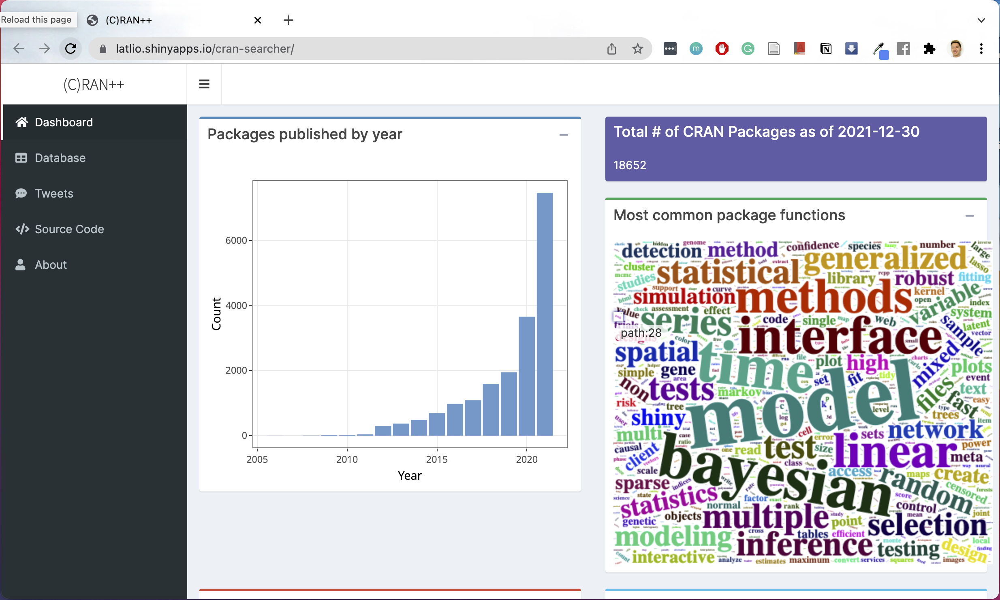
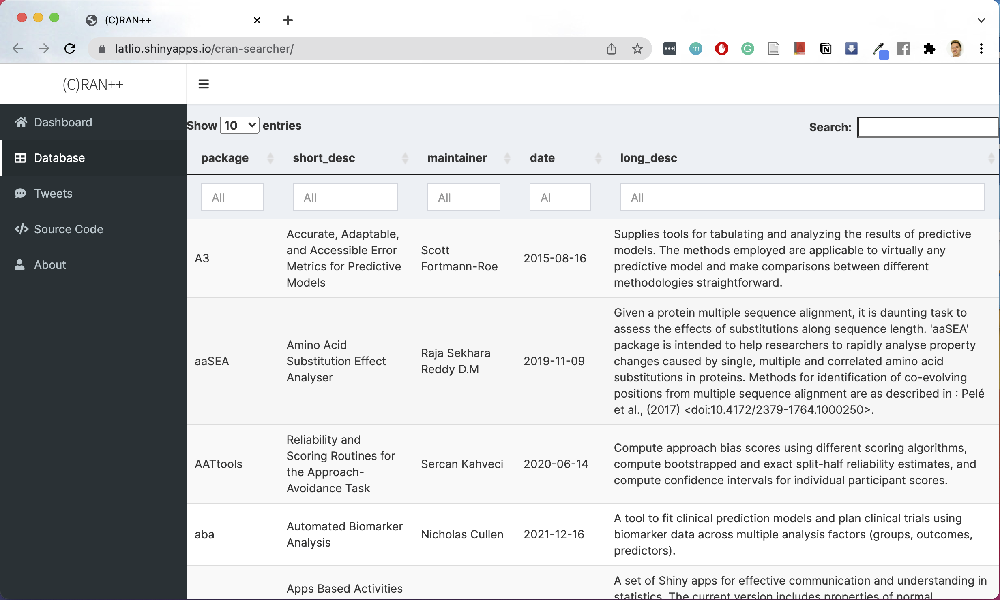
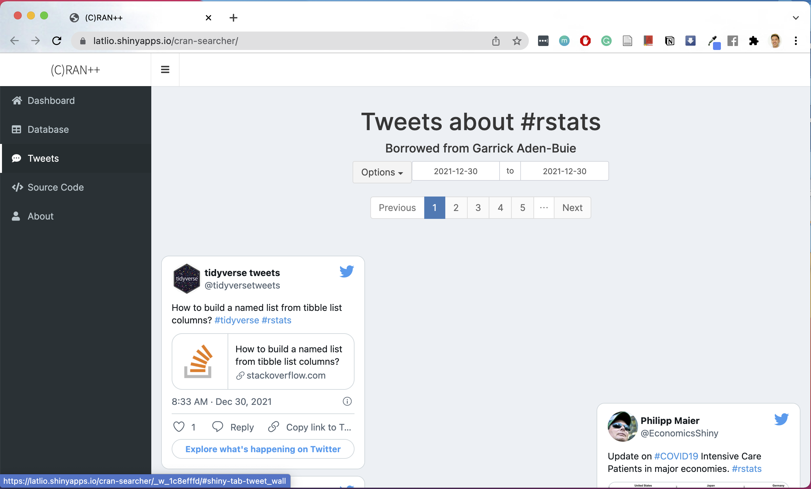

<h3 align="center">(C)RAN++</h3>

  

    A Shiny App to search CRAN
     
    <a href="https://github.com/latlio/cran-searcher"><strong>Explore the docs »</strong></a>
     
     
    <a href="https://latlio.shinyapps.io/cran-searcher/">View App</a>
    ·
    <a href="https://github.com/latlio/cran-searcher/issues">Report Bug</a>
    ·
    <a href="https://github.com/latlio/cran-searcher/issues">Request Feature</a>
  

<!-- TABLE OF CONTENTS -->

  
Table of Contents

  <ol>
    <li>
      <a href="#about-the-project">About The Project</a>
      <ul>
        <li><a href="#built-with">Built With</a></li>
      </ul>
      <ul>
        <li><a href="#notes">Notes</a></li>
      </ul>
    </li>
    <li>
      <a href="#usage">Usage</a>
      <ul>
        <li><a href="#dashboard">Dashboard</a></li>
      </ul>
      <ul>
        <li><a href="#database">Database</a></li>
      </ul>
      <ul>
        <li><a href="#tweets">Tweets</a></li>
      </ul>
    </li>
    <li><a href="#contributing">Contributing</a></li>
    <li><a href="#contact">Contact</a></li>
    <li><a href="#references">Acknowledgments</a></li>
  </ol>

<!-- ABOUT THE PROJECT -->
## About The Project

From personal experience, I know how difficult it is to keep up with the R ecosystem. There are so many new packages and creative ways in which people are using R to do amazing things. R users will all be familiar with CRAN, or the Comprehensive R Archive Network, which acts as a regulated repository for all R packages. I've created a simple Shiny App that provides a summary of CRAN (a la #spotifywrapped), a searchable database  of all CRAN packages that updates periodically, and a Twitter board (#rstats) showcasing new functions and creative/cool ways to use R.

Enjoy!

### :pray: Built With

* [tidyverse](https://www.tidyverse.org/)
* [shiny](https://shiny.rstudio.com/)
* [shinydashboard](https://rstudio.github.io/shinydashboard/)
* [shinycssloaders](https://github.com/daattali/shinycssloaders)
* [plotly](https://plotly.com/)
* [rtweet](https://github.com/ropensci/rtweet)

(<a href="#top">back to top</a>)

### Notes

* Web scraping is performed with a configured Google DNS server on MacOS Big Sur (v11.6.1)
* I parallelized the web scraping script using `foreach` and `doParallel`

(<a href="#top">back to top</a>)

## Usage

There are three primary tabs: Dashboard, Database, and Tweets.

### Dashboard

The opening dashboard shows a few visualizations about the current number of CRAN packages, the number of published packages per year, the most popular package functions (extracted from their descriptions) and the most popular imported and suggested packages. 

(<a href="#top">back to top</a>)

### Database

To the best of my knowledge, there is no data table for all of CRAN's packages, and it can be difficult to search through CRAN for a specific package. The **Databse** provides a searchable [dataTable] of CRAN packages. Users can search for text in any field or use regex in the main search bar.

(<a href="#top">back to top</a>)

### Tweets

The **Tweet Bulletin Board** was taken from Garrick Aden-Buie, and it shows all tweets containing `#rstats` in a Pinterest-style wall. Users can quickly scan and read the stream of tweets. Additionally, configurable date filters allow users to look for tweets from particular date ranges.

(<a href="#top">back to top</a>)

<!-- CONTRIBUTING -->
## Contributing

Contributions are what make the open source community such an amazing place to learn, inspire, and create. Any contributions you make are **greatly appreciated**.

If you have a suggestion that would make this better, please fork the repo and create a pull request. You can also simply open an issue with the tag "enhancement".
Don't forget to give the project a star! Thanks again!

1. Fork the Project
2. Create your Feature Branch (`git checkout -b feature/AmazingFeature`)
3. Commit your Changes (`git commit -m 'Add some AmazingFeature'`)
4. Push to the Branch (`git push origin feature/AmazingFeature`)
5. Open a Pull Request

(<a href="#top">back to top</a>)

<!-- CONTACT -->
## Contact

Twitter: [@lathanliou](https://twitter.com/LathanLiou)

Project Link: [(C)RAN++](https://github.com/github_username/repo_name)

(<a href="#top">back to top</a>)

<!-- References -->
## References

* [Text Analysis Textbook](https://www.tidytextmining.com/)
* [Text Analysis Article](https://www.red-gate.com/simple-talk/databases/sql-server/bi-sql-server/text-mining-and-sentiment-analysis-with-r/)
* [README template](https://github.com/latlio/Best-README-Template/blob/master/BLANK_README.md)
* [Changing DNS Server](macinstruct.com/tutorials/how-to-change-your-macs-dns-servers/)
* [Shiny Wordcloud2 workaround](https://github.com/rstudio/shinydashboard/issues/281)
* [Dashboard Inspiration](garrickadenbuie.com)

(<a href="#top">back to top</a>)
